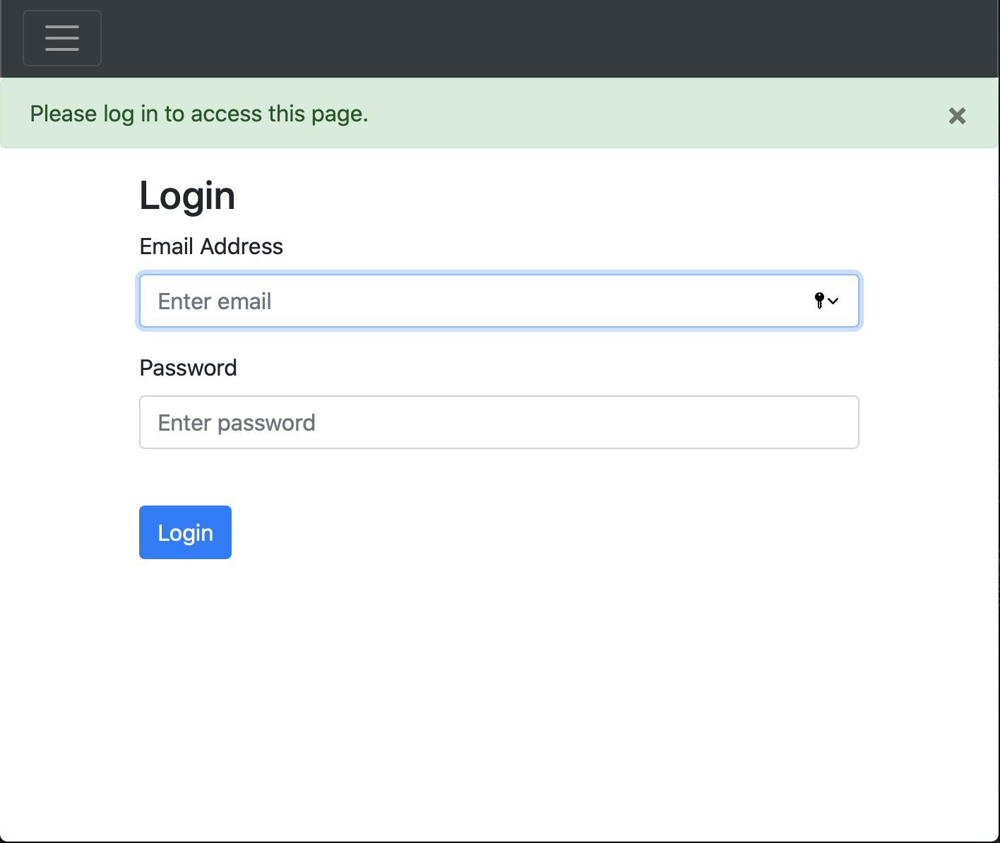
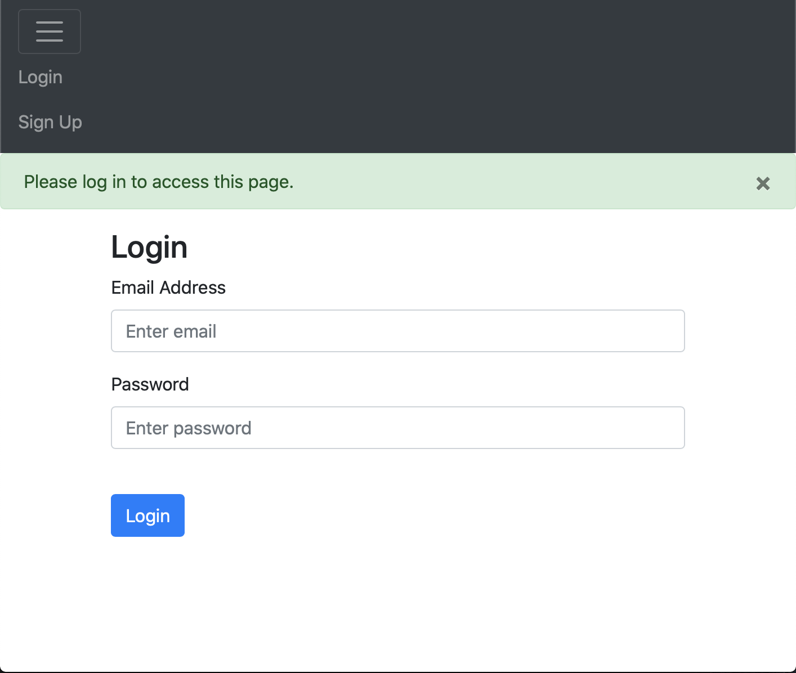
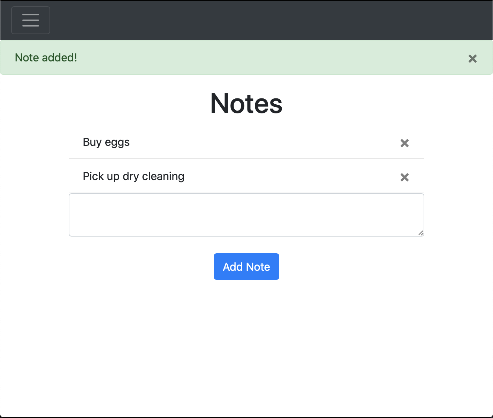
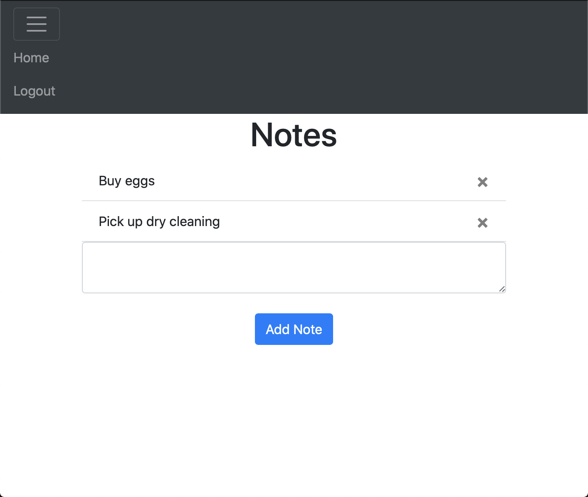

# PythonSite

A site that uses Flask a Python web framework to create a database and user authentification

Uses some HTML for formatting, bootstrap for the hamburger (header), and javascript for the notes functionality

With this site a user can create an account, login, create/delete notes, logout, and access those notes whenever they want

I built this site to get a better understanding of loign and authentification that could eventually be used with another application

To use this site the user must insall the following:

Make sure you have Python3 installed 

Use pip on windows and pip3 on unix based systems

- pip install flask
- pip install flask-login
- pip install flask-sqlalchemy

The two images below show the login page, which allows the user to either login or access the sign up page
 

The next two images show the notes page, which allows the user to create and delete notes and logout
 
